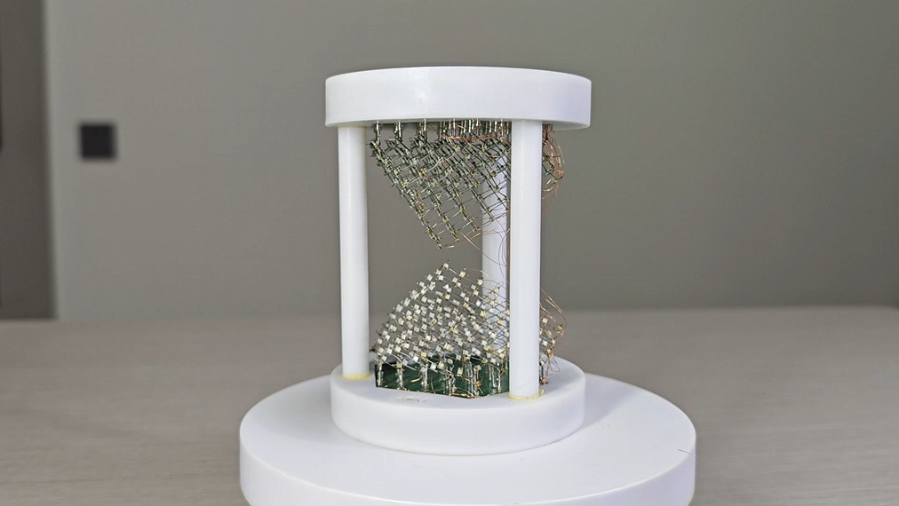

# 3D Electronic hourglass

## 1 Introduction
This project is an improved version of the common flat electronic hourglass. On its basis, a 3D display structure is added to match the corresponding display control effect, realizing the electronic hourglass function of 3D stereoscopic display.

## 2 Feature
* After turning on the machine, it starts to simulate the effect of hourglass operation.
* Use the gyroscope to judge the hourglass posture to achieve different operating effects
* There is a button on the top and bottom, which can switch different timing times (todo)
* There are three indicator lights below to show the current timing time (todo)
* Support battery power supply and charging

## 3 Principle Analysis
* This project is realized through the innovative modification of the traditional 888 light cube
* By rotating and shearing the cube, a structure with an hourglass-like appearance is obtained.
* The flow effect of sand is achieved through a control method similar to that of a planar electronic hourglass

### If you have any questions about this project, please feel free to discuss with me in the issue.
