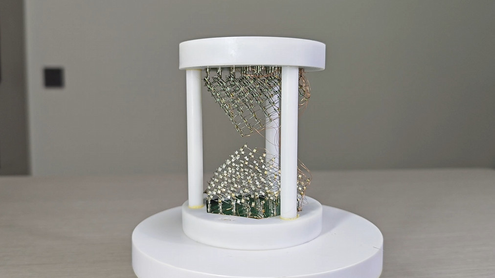

# 3D 电子沙漏 | [3D Electronic hourglass](./README-EN.md)

## 1 项目概述
本项目是常见的平面电子沙漏的改进版本，在其基础上添加了3D显示结构，匹配对应的显示控制效果，实现了3D立体显示的电子沙漏功能。

## 2 功能介绍
* 开机后随机开始模拟沙漏运行的效果
* 通过陀螺以判断沙漏姿态，来实现不同的运行效果
* 上下各有一个按键，按下后可以切换不同的计时时间(todo)
* 上下各有三个指示灯，用来显示当下正在计时的时间(todo)
* 支持电池供电和充电

## 3 原理解析
* 本项目通过对传统888光立方的创新改装实现
* 通过旋转和剪切立方体，得到与沙漏相似的外观结构
* 通过与平面电子沙漏类似的控制方法实现沙子的流动效果 

### 如果对本项目有任何疑问，欢迎在issue中与我讨论。
